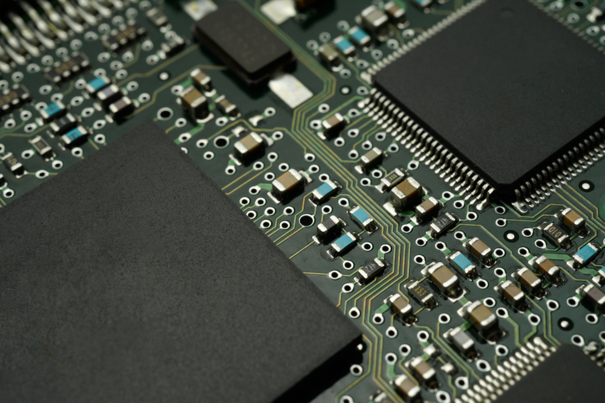

# EEC110B-Electronic Circuits
 
This is an introductory electronic circuit course that covers the application of **Bipolar** and Meta-Oxide Silicon (**MOS**) transistors in single and multi-stage amplifiers. Different amplifier topologies such as Common-Base, Common-Emitter, and Common-Source BJT are covered. We also discussed other crucial amplifiers such as **Current Mirror** and **Differential Amplifier**.

## Course Content

### Bipolar Transistor
* [Introduction to Bipolar Transistor](./lecture/Bipolar_Transistor.md)
* [Different Topologies of Bipolar Amplifiers](./lecture/Bipolar_Amplifier.md)

### MOS Transistor
* [Introduction to MOS Transistor](./lecture/Mos_Transistor.md)

### Important Amplifiers
* [Current Mirror](./lecture/Current_Mirror.md)
* [Differential Amplifier](./lecture/Differential_Amplifier.md)

### Lab
* [Characteristics of BJT and MOS Transistors](./lab/lab_transistor_char.md)

## Course Evaluation
* It's interesting that although transistors are nonlinear devices, we still try to linearize them and then compute the voltage and currents with elementary circuit analysis methods.
* As a result, I gain a deeper understanding of circuit analysis.
* However, computing the large and small signal model of the transistors becomes more and more tedious towards the end of the course. The process is very repetitive and once you cross that learning curve; you hardly learn new things.
* Overall, I'll give EEC110B a 3/5 because it's hard to learn circuits without a course: I will lose motivation.

## Reference
* This is the note that I took while taking **Professor Omeed Momeni**'s EEC110B course in the Spring of 2024. A detailed course description can be found here: [https://ece.ucdavis.edu/course-catalog](https://ece.ucdavis.edu/course-catalog)
* In this course, we used the following textbook: **Fundamentals of Microelectronics by Behzad Razavi, 3rd Edition**.