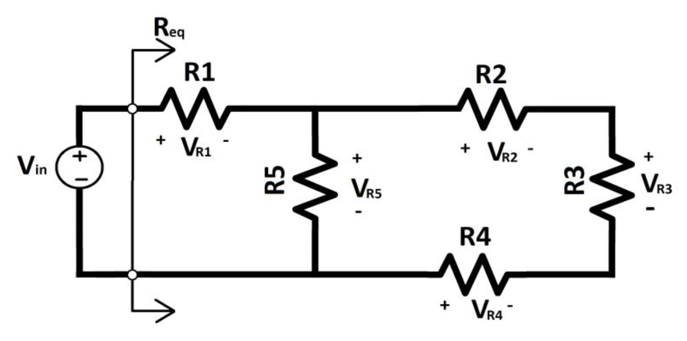
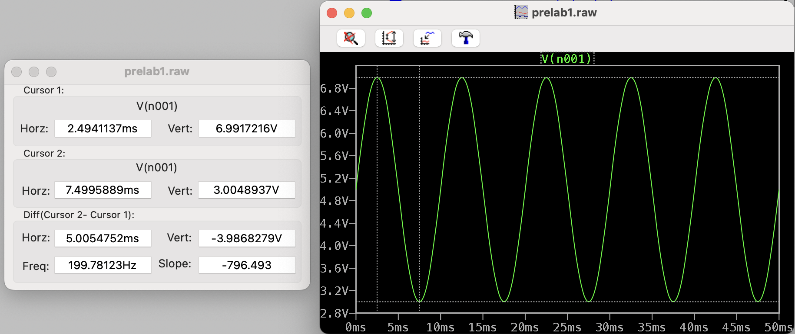
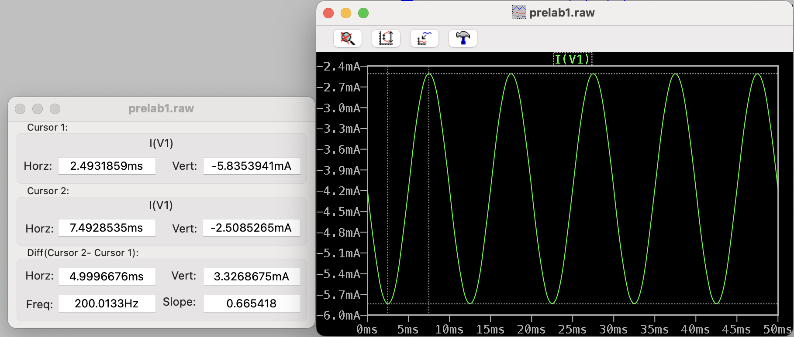

# EEC 110B PreLab 1 - Introduction and Setup

## Theoretical-Calculation

Assume $V_{in} = 5 \space V$.

First, we can make $R_2$, $R_3$, $R_4$ in series and get 

$$R_{eq1} = R_2 + R_3 + R_4 = 247 \space \Omega$$

Next, we can combine $R_{eq1}$ and $R_5$ in parallel to get 

$$R_{eq2} = R_5 || R_{eq1} = \frac{R_5 R_{eq1}}{R_5 + R_{eq1}} = \frac{R_5 (R_2 + R_3 + R_4)}{R_5 + (R_2 + R_3 + R_4)} = 198.1 \space \Omega$$

Lastly, we get $R_{eq}$ by combining combining $R_1$ and $R_{eq2}$ in series

$$R_{eq} = R_1 + \frac{R_5 (R_2 + R_3 + R_4)}{R_5 + (R_2 + R_3 + R_4)} = 1198 \space \Omega$$ 

To get the voltage and current across each resistor, we work backward to find the voltage then use Ohm's Law to find the current

$$V_{R1} = \frac{V_{in}}{R_{eq}} R_1$$

$$V_{R5} = \frac{V_{in}}{R_{eq}} R_{eq2}$$

$$V_{R2} = \frac{V_{R5}}{R_{eq1}} R_2$$

$$V_{R3} = \frac{V_{R5}}{R_{eq1}} R_3$$

$$V_{R4} = \frac{V_{R5}}{R_{eq1}} R_4$$

| Resistor | Resistance (Ω) | Voltage (V) | Current (mA) |
| --------:|---------------:|------------:|-------------:|
| $R_1$ | 1k | 4.17 | 4.17 |
| $R_2$ | 100 | 0.335 | 3.35 |
| $R_3$ | 100 | 0.335 | 3.35 |
| $R_4$ | 47 | 0.157 | 3.35 |
| $R_5$ | 1k | 0.827 | 0.827 |

## Simulation

| Resistor | Resistance (Ω) | Voltage (V) | Current (mA) |
| --------:|---------------:|------------:|-------------:|
| $R_1$ | 1k | 4.174 | 4.2 |
| $R_2$ | 100 | 0.335 | 3.4 |
| $R_3$ | 100 | 0.335 | 3.4 |
| $R_4$ | 47 | 0.157 | 3.4 |
| $R_5$ | 1k | 0.827 | 0.814 |

$$R_{eq} = \frac{V_{in}}{I_{in}} = \frac{5 \space V}{4.2\space mA} = 1190.5 \space \Omega$$

## Transient Simulation

$V_{p-p} = 3.99 \space V$

$I_{p-p} = 3.33 \space mA$