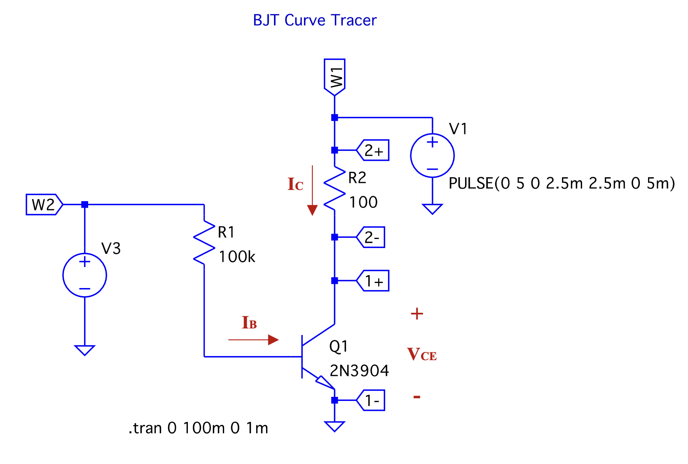
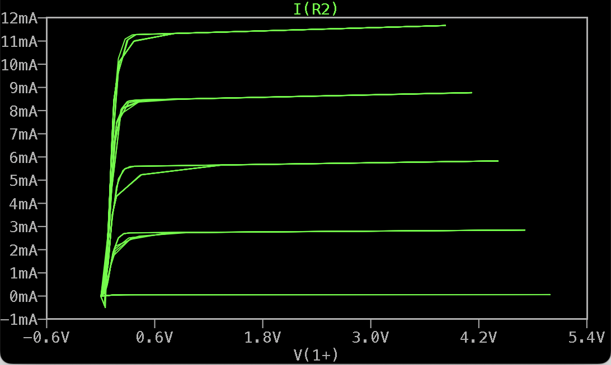
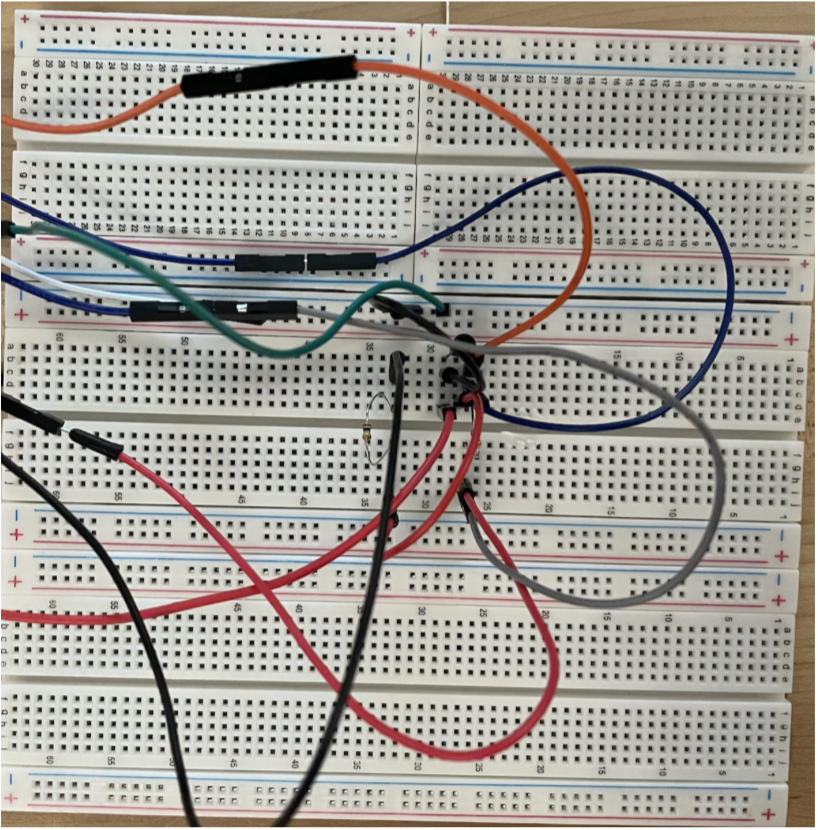
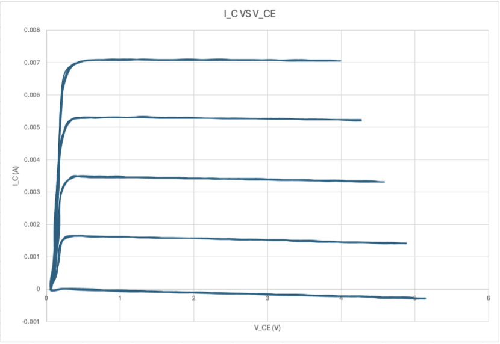
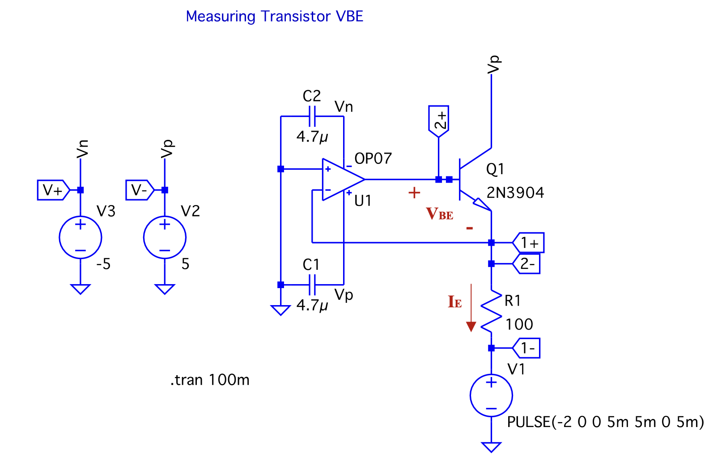
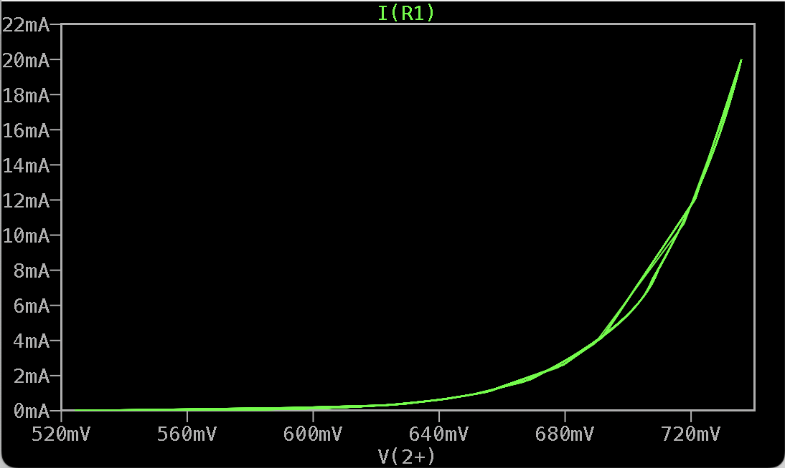
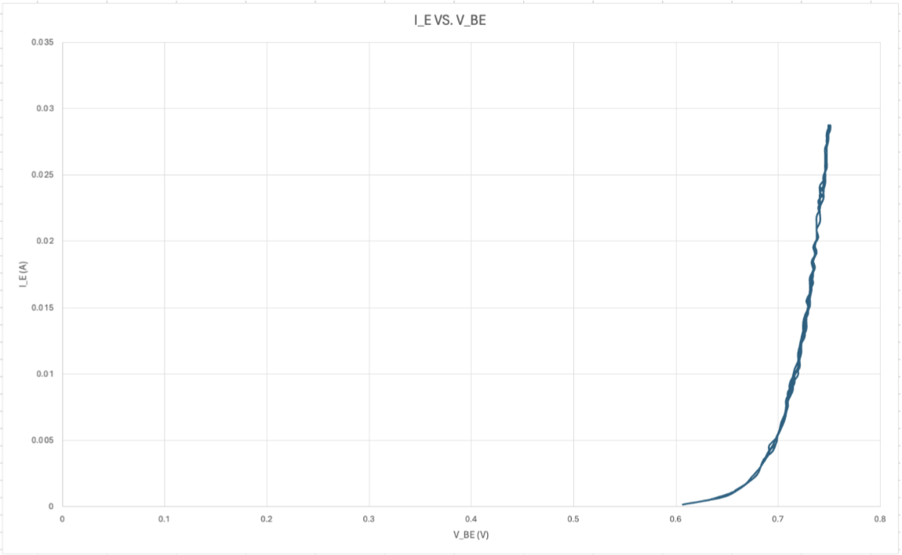

# Lab 1 - Transistor's Characteristics

The goal of this lab is to understand the behavior of BJT and MOS transistors after applying voltage to their different terminals.
We simulated the behavior of the circuit first, then built the circuit on a breadboard.

## BJT Collector Current and Collector-Emitter Voltage

### Simulation

We want to examine the $I_C \space vs \space V_{CE}$ graph of the BJT and find the early voltage, $V_A$, and the early effect resistance, $r_o$, so that we can compare it to that of the experiment. The following Figure shows the simulated result.

By rearranging the $I_C = I_S e^{\frac{V_{BE}}{V_T}}(1+\frac{V_{CE}}{V_A})$ equation, we can find that on the top-most $I_C$ curve

$$V_A = \frac{V_{CE1}I_{C2} - V_{CE2}I_{1}}{I_{C1} - I_{C2}}$$

| Point | $V_{CE} \space (V)$| $I_{C} \space (mA)$|
|------:|-------:|------:|
| 1 | 1.666 | 11.4227 |
| 2 | 1.3923 | 11.3909 |

$V_A = 96.6 V$

The $r_o$ for $I_C = 7.07 mA$ is 14 kΩ

### Experiment

We built the BJT circuit and obtained the same curves

| Point | $V_{CE} \space (V)$| $I_{C} \space (mA)$|
|------:|-------:|------:|
| 1 | 0.89 | 7.07 |
| 2 | 1.05 | 7.10 |

$V_A$ = 36.8 V

$r_o = 5.2 kΩ$

### Comparison

| Type | $V_A \space (V)$ | $r_o \space (kΩ)$ |
|-----:|------:|------:|
| Simulation | 96.6 | 14 |
| Experiment | 36.8 | 5.2 |

The simulation and experiment gave drastically different results. A measurement error likely occurred during the lab.

## BJT Collector Current and Base-Emitter Voltage

### Simulation

Given this $I_{C} \space vs V_{BE}$ curve, we want to calculate the small signal transconductance at $I_C = 6 \space mA$ by calculating the slope around $6\space mA$.

| Point  | $V_{BE} \space (mV)$ | $I_C \space (mV)$ |
|-:|-:|-:|
| 1 | 695 | 5 |
| 2 | 702.9 | 7 |

$g_m = 0.253 \space S$

### Experiment

After constructing the circuit and setting up the signals, we obtained the following graph: 

| Point  | $V_{BE} \space (mV)$ | $I_C \space (mV)$ |
|-:|-:|-:|
| 1 | 703.09 | 5.88 |
| 2 | 706.4 | 6.48 |

$g_m = 0.181 \space S$

### Comparison

| Type | $g_m \space (S)$ |
|-----:|------:|
| Simulation | 0.253 |
| Experiment | 0.181 |

The experimental result is **28%** lower than that of the experimental result. This could come from the errors in approximating $g_m$ by finding the slope but not the derivative.
