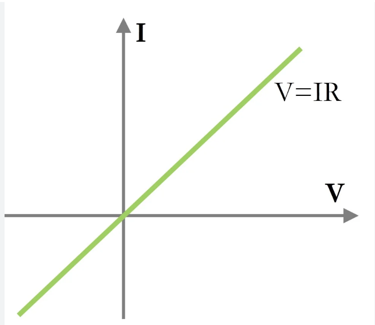

# Bipolar Amplifier

A voltage-controlled current source can form an amplifier, and here are some metrics that evaluate the performance of the amplifier:
* **Power Dissipation** - Determines the battery lifetime
* **Speed** - Operating frequency
* **Noise** - Amplifier introduces noise

## 1. I/O Resistance

An ideal voltage amplifier has an input that acts as a voltmeter, which senses the voltage without disturbing (loading) the preceding stage.

The ideal **input impedance is infinite**

At the output, the circuit will be connected in parallel to the output. Therefore, it should have a **zero output impedance** to not create a voltage divider.

We can analyze the I/O impedance by applying a test voltage $V_X$ and dividing it by the current.

Here's an example of calculating the input impedance:

### Test Voltage

But how does applying a test voltage work?

Let's remember that Ohm's Law states that the voltage difference across a device is proportional to the current flowing through it. This proportionality constant is the **equivalent resistance** of the device and can be found through plotting an I-V curve like this:

Note that the curve always intersects the origin because current cannot exist when the voltage difference, V, is 0 across the device. **Current always flows from high to low potential**. This means that we just need to find one set of current and voltage data points to find the slope or the equivalent resistance.

Therefore, we apply a test voltage, $V_T$, across the device and calculate the total current, $I_T$, flowing through the device. 

$$R_{eq} = \frac{V_T - 0}{I_T - 0} = \frac{V_T}{I_T}$$

#### Resistance of an Ideal Voltage Source

To calculate the equivalent resistance looking into an ideal voltage source, we apply the test voltage again. However, we find that the I-V curve of the ideal voltage source must not cross the origin of a non-zero source. **An ideal voltage source must maintain the same voltage difference regardless of the current through it**, so we can assume that when the current is 0, the voltage difference is still $V_{ideal}$. Also, $V_T$ must be $V_{ideal}$ when we apply the test voltage since they are in parallel and $V_T$ must share the same voltage difference with an ideal voltage source.

$$R_{eq} = \frac{V_{ideal}-V_{ideal}}{I_{_T} - 0} = 0$$

Therefore, we found that the equivalent resistance looking into an ideal voltage source is 0, which means we could model it as a **short circuit**.

#### Resistance of Ideal Current Source

Similar to the ideal voltage case, the ideal current source exhibits interesting properties. We know that **an ideal current source must maintain the same current through itself regardless of the voltage difference across it.**

$$R_{eq} = \frac{V_T - 0}{I_{ideal} - I_{ideal}} = \infty$$

The equivalent impedance looking into an ideal current source is infinite, which could be modeled by an **opened circuit**.

### Output Impedance

If we want to find the output resistance, we should set the input source to zero because the equivalent circuit of any independent voltage source is zero.

Then we apply the test voltage on the device and find its current and perform calculations just like what we did in the input resistance.

## 2. NPN BJT Small Signal Characteristics

| Topology | Schematic | Gain | Input Impedance | Output Impedance |
|---: |---: |---: |---: |---: |
| Common-Emitter |  | $\frac{-R_C}{R_E + \frac{1}{g_m}}$ | $r_{\pi} + R_E (1 + \beta)$ | $R_C$ |
| Common-Base |  | $\frac{R_C}{R_E (1 + \frac{1}{\beta}) + \frac{1}{g_m}}$ | $\frac{1}{g_m + \frac{1}{r_{\pi}}} + R_E$ | $R_C$ |
| Common-Collector |  | $\frac{R_E}{R_E + \frac{1}{g_m (1 + \frac{1}{\beta})}}$ | $r_{\pi} + R_E (1 + \beta)$ | $\frac{1}{g_m + \frac{1}{R_E} + \frac{1}{r_{\pi}}}$ |
| Diode Connected - Base Collector Grounded - Look into Emitter |  | | $\frac{1}{g_m + \frac{1}{r_{\pi} \|\| r_o}}$ | |
| Diode Connected - Emitter Grounded - Look into Collector |  | | $\frac{1}{g_m + \frac{1}{r_{\pi} \|\| r_o}}$ | |

Note:
* Common-Collector is calculated with $V_A = \infty$
* PNP transistor has the same small signal model but the collector and emitter are inverted in the symbol.
* To obtain the characteristics for MOS transistors, set $\beta \to \infty$.