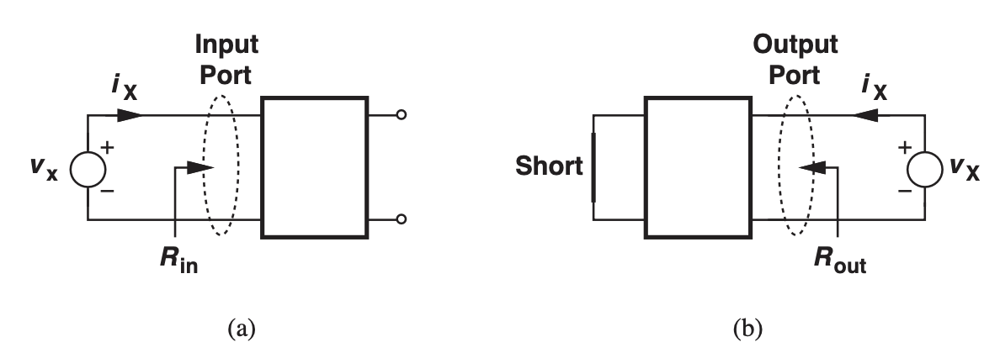
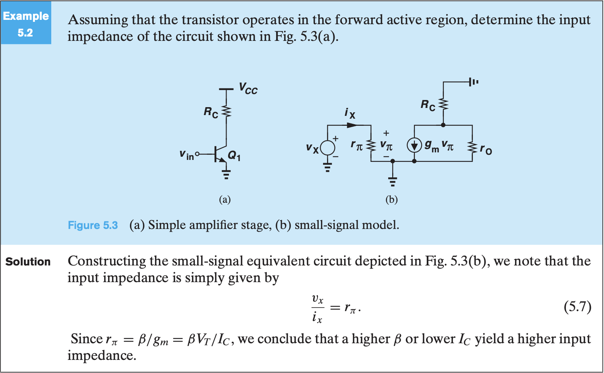
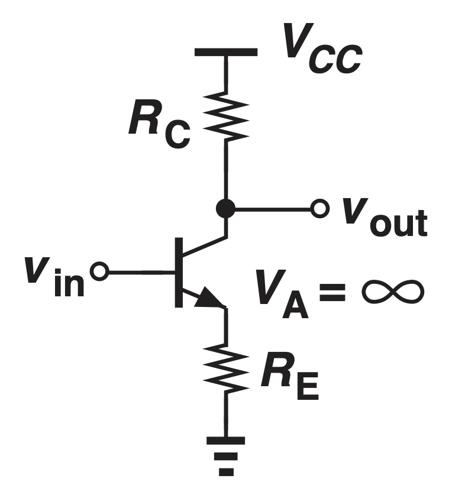
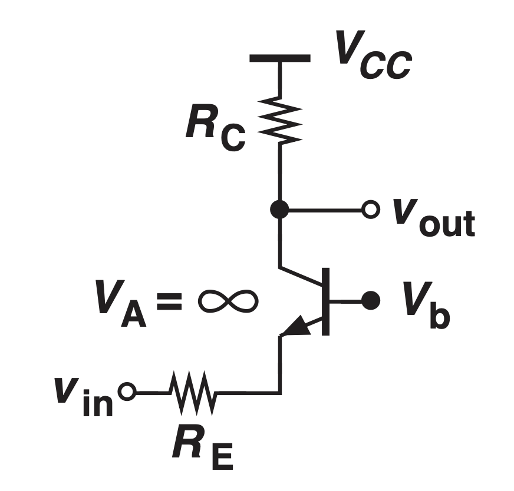
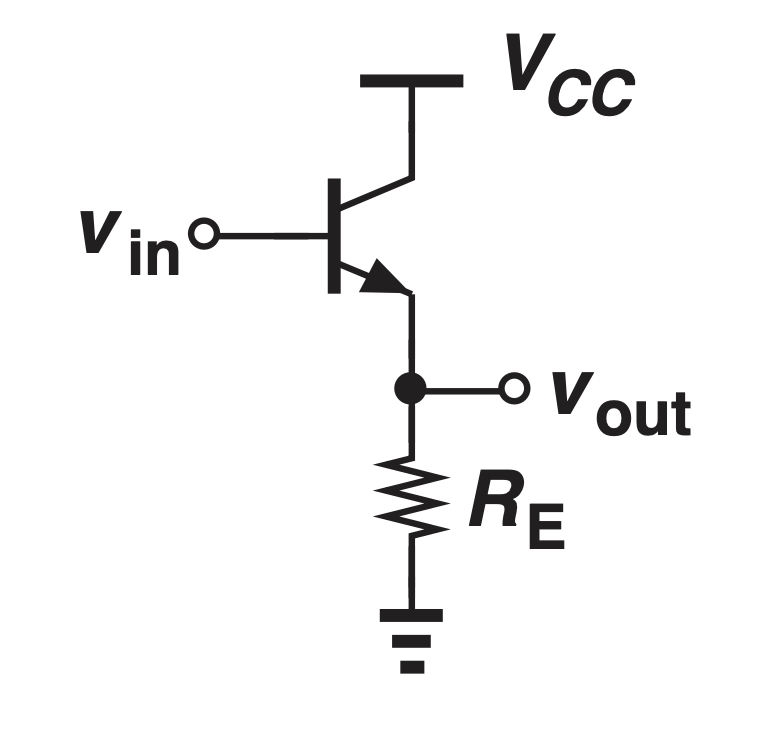
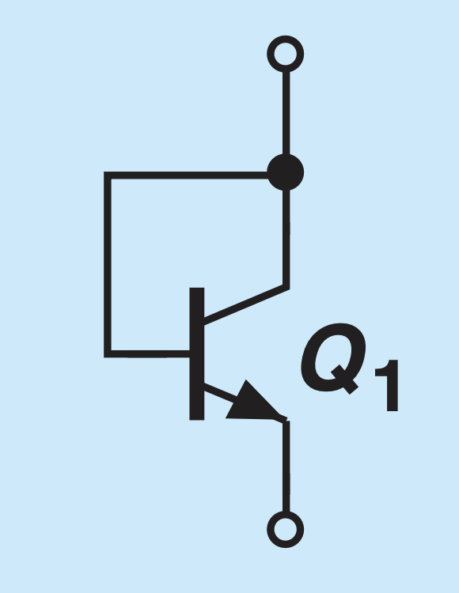

# Bipolar Amplifier

A voltage-controlled current source can form an amplifier, and here are some metrics that evaluate the performance of the amplifier:
* **Power Dissipation** - Determines the battery lifetime
* **Speed** - Operating frequency
* **Noise** - Amplifier introduces noise

## I/O Resistance

An ideal voltage amplifier has an input that acts as a voltmeter, which senses the voltage without disturbing (loading) the preceding stage.

The ideal **input impedance is infinite**

At the output, the circuit will be connected in parallel to the output. Therefore, it should have a **zero output impedance** to not create a voltage divider.

We can analyze the I/O impedance by applying a test voltage $V_X$ and dividing it by the current.

Here's an example of calculating the input impedance:

We should set the input source to zero because the equivalent circuit of any independent voltage source is zero.
That's because we calculate the equivalent resistance by finding the slope R from a change in applied voltage and change in current

$$R = \frac{V_2 - V_1}{I_2 - I_1}$$

For an ideal independent voltage source, the voltage is constant regardless of applied voltage to its node, so $V_2 - V_1 = 0$

As a result, its equivalent resistance is zero, which is a wire.

## NPN BJT Small Signal Characteristics

| Topology | Schematic | Gain | Input Impedance | Output Impedance |
|---: |---: |---: |---: |---: |
| Common-Emitter |  | $\frac{-R_C}{R_E + \frac{1}{g_m}}$ | $r_{\pi} + R_E (1 + \beta)$ | $R_C$ |
| Common-Base |  | $\frac{R_C}{R_E (1 + \frac{1}{\beta}) + \frac{1}{g_m}}$ | $\frac{1}{g_m + \frac{1}{r_{\pi}}} + R_E$ | $R_C$ |
| Common-Collector |  | $\frac{R_E}{R_E + \frac{1}{g_m (1 + \frac{1}{\beta})}}$ | $r_{\pi} + R_E (1 + \beta)$ | $\frac{1}{g_m + \frac{1}{R_E} + \frac{1}{r_{\pi}}}$ |
| Diode Connected - Base Collector Grounded - Look into Emitter |  | | $\frac{1}{g_m + \frac{1}{r_{\pi} \|\| r_o}}$ | |
| Diode Connected - Emitter Grounded - Look into Collector |  | | $\frac{1}{g_m + \frac{1}{r_{\pi} \|\| r_o}}$ | |

Note:
* Common-Collector is calculated with $V_A = \infty$
* PNP transistor has the same small signal model but the collector and emitter are inverted in the symbol.
* To obtain the characteristics for MOS transistors, set $\beta \to \infty$.