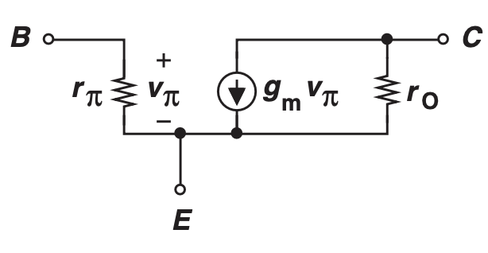

# Bipolar Transistor Operations

## Introduction

The Bipolar Transistor (BJT) is made of three doped silicon regions. The outer two regions are doped with the same polarity while the middle region is doped with opposite polarity. Therefore, there is a PNP and NPN bipolar transistor. In this document, we will abstract away the physical behaviors of the BJT and model it with a small and large signal model when it's in the region of operation.

## Summary

### NPN Bipolar Transistor

**Forward-Active Region**:

$$V_{BE} > 0$$

$$V_{CE} > V_{BE}$$

**Large Signal Models**

$$I_B = \frac{1}{\beta} I_C$$

$$I_C = I_s e^{\frac{V_{BE}}{V_T}}$$

$$I_E = \frac{\beta + 1}{\beta} I_C$$

$$\beta \in [50, 200]$$

$$V_T = 26 \space mV$$

### PNP Bipolar Transistor

**Forward-Active Region**:

$$V_{EB} > 0$$

$$V_{EC} > V_{EB}$$

**Large Signal Model**

$$I_B = \frac{1}{\beta} I_C$$

$$I_C = I_s e^{\frac{V_{EB}}{V_T}}$$

$$I_E = \frac{\beta + 1}{\beta} I_C$$

$$\beta \in [50, 200]$$

**Small Signal Model**: Same for NPN and PNP

$$g_m = \frac{I_C}{V_T}$$

$$r_{\pi} = \frac{\beta}{g_m}$$

$$r_o = \frac{V_A}{I_C}$$

## NPN Regions of Operation - Forward Active Region

**NPN BJT Requirement**
* Base-emitter junction is forward-biased ($V_{BE} > 0$)
* Base-collector junction is reverse-biased ($V_{BC} < 0$)

$$V_B - V_C < 0$$

$$\implies V_B < V_C$$

$$\implies V_B - V_E < V_C - V_E$$

$$\implies V_{BE} < V_{CE}$$

In summary, 

$$V_{BE} < V_{CE}$$
$$V_{BE} > 0$$

**Collector Current**

$$I_C \approx I_s e^{\frac{V_{BE}}{V_T}}$$

where $V_T = \frac{kT}{q} \approx 26 \space mV$ at 300 K

which means, 

$$V_{BE} \approx V_T \ln\Big(\frac{I_C}{I_s}\Big)$$

Ideally, the collector current is **not** a function of $V_{CE}$. We want it to be a voltage-dependent current source that depends on $V_{BE}$.

**Large Signal Model**

A diode is placed between the base and emitter and a voltage-controlled current source is placed between the collector and emitter.

$$I_C = \beta I_B$$

$$I_E = \frac{\beta + 1}{\beta} I_C$$

$\beta$ is the current gain of the transistor because it shows how much the current gain is amplified. The $\beta$ of npn transistor typically ranges from 50 to 200.

**Small-Signal Model**

The small signal model describes the behavior of the transistor when a small perturbation of voltages (EX: Sinusoidal perturbation) is applied to the transistor nodes.

$g_m$ is the **Transconductance**, as it measures how well the transistor converts voltage to current. Therefore, it's the slope in the $I_C$ vs $V_{BE}$ graph.

$$g_m = \frac{d I_C}{d V_{BE}} = \frac{d}{d V_{BE}} \Big(I_s e^{\frac{V_{BE}}{V_T}} \Big) = \frac{I_C}{V_T}$$

$r_{\pi}$ is the resistance between the base and emitter.

$$r_{\pi} = \frac{d V_{BE}}{d I_B} = \frac{\beta}{g_m}$$

$r_o$ is the early effect resistance between the collector and emitter.

$$r_o = \frac{d V_{CE}}{d I_C} = \frac{V_A}{I_C}$$

**Early Effect**

The collector current becomes larger than usual and a function of $V_{CE}$

In the large signal model, a correction factor is added to account for $I_C$'s dependence on $V_{CE}$. $V_A$ is called the early voltage.

Now,

$$I_C = \Big(I_s e^{\frac{V_{BE}}{V_T}}\Big)\Big( 1 + \frac{V_{CE}}{V_A}\Big)$$

As $V_A \longrightarrow \infty$, there's no early effect.

## NPN Regions of Operation - Soft Saturation
* Base-emitter junction is forward biased ($V_{BE} > 0$)
* Base-collector junction is weakly forward-biased ($-200\space mV \leq V_C - V_B \leq 0$)

## NPN Regions of Operation - Deep Saturation
* Base-emitter junction is forward biased ($V_{BE} > 0$).
* Base-collector junciton is heavily forward-biased ($V_C - V_B \leq -200 \space mV $).

The transistor loses its voltage-controlled current capability and $V_{CE}$ becomes constant.

Superposition

Why Large Signal

Why Small Signal

Good to have a high input impedance because it will minimally change the gain of the preceding stage

Why do input and output impedances matter for current and voltage source amplifiers?

## Common-Emitter Amplifier with Degeneration

* Pro: More stable DC 
* Con: low gain

$$A_v = -\frac{g_m R_c}{1 + R_E(\frac{1}{r_{\pi}} + g_m)}$$

Since $g_m >> \frac{1}{r_{\pi}}$

we have

$$A_v = -\frac{R_c}{\frac{1}{g_m} + R_E}$$

$$R_{in} = r_{\pi} + (\beta + 1) R_E$$

$R_{out} = R_c$, $V_A -> \infty$

$V_A \neq \infty$

$$R_{out} = [1 + g_m (R_E || r_{\pi})]r_o + R_E || r_{\pi}$$

when $g_m r_o >> 1$

$$R_{out} = [1 + g_m (R_E || r_{\pi})]r_o$$ 

