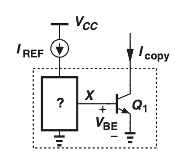
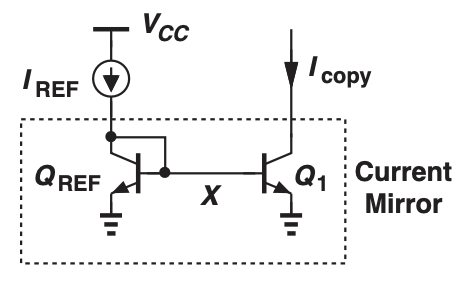
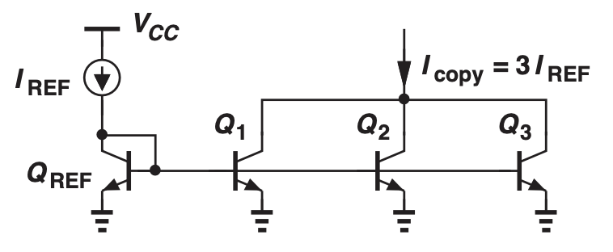
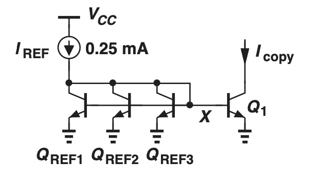
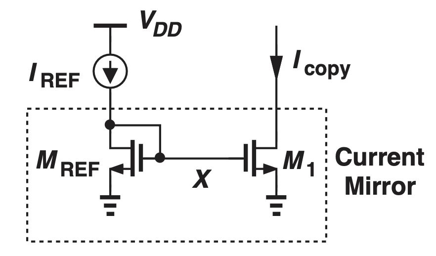

# Current Mirror

In BJT and MOS amplifiers, the biasing currents are often dependent on the supply voltage and the temperature.

However, in certain applications such as the mobile phone, the supply voltage could vary. We also want the phone to be operating in different temperatures across the world.

The **Bandgap Reference Circuit** is a circuit that removes dependence on the supply voltage and the temperature.

However, the bandgap reference circuit is hard to produce and the mobile phone needs many of these.

As a result, we need a method to copy the bandgap reference circuit, which is the purpose of the **Current Mirrors**.

**Solution 1:** Bandgap Reference Current creates supply and temperature independent of voltages and currents. However, it's complex so cannot be used everywhere in a large integrated circuit.

**Solution 2:** Bandhap reference provides a "golden current" as $I_{ref}$ and uses the **current mirror** to **copy** $I_{ref}$ without replicating the entire bandgap circuitry.

Solution 2 is more feasible.

The black box satisfies the relationship:

$$V_X = V_T \ln\frac{I_{REF}}{I_{S1}}$$

Therefore, the black box will be another bipolar transistor with the base attached to X and collector to $I_{REF}$.

We need the connection from the collector to the base of $Q_{REF}$ because there would be two base currents flowing in the opposite direction without this connection, which is a contradiction.

However, we will treat the base current flowing out of the $I_{REF}$ as very small.

As a result, we have:

$$I_{REF} = I_{S,REF} \space e^{\frac{V_X}{V_T}}$$

$$I_{copy} = I_{S1} \space e^{\frac{V_X}{V_T}}$$

$$I_{copy} = \frac{I_{S1}}{I_{S,REF}}I_{REF}$$

The final equation reduces to $I_{copy} = I_{REF}$ if the BJTs are identical.

To copy and multiply the reference current, we can add and place the copying BJTs in parallel:

To copy and divide the reference current, we can add and place the reference BJT in parallel:

Since placing BJT in parallel equates to increasing the emitter area, **doubling the emitter area in copy BJT doubles the biasing current**

So far, we've neglected the base current. However, taking into account the base current will give this equation instead:

$$I_{copy} = \frac{n I_{REF}}{1 + \frac{1}{\beta}(n + 1)}$$

For a big $\beta$, the equation is identical to that of the no base current ideal mirror.

We can modify this circuit to make that actual equation closer to the ideal mirror.

$$I_{copy} = \frac{n I_{REF}}{1 + \frac{1}{\beta^2}(n + 1)}$$

## MOS Current Mirror

If we assume no channel length modulation, then 

$$I_{REF} = \frac{(\frac{W}{L})_1}{(\frac{W}{L})_{REF}} I_{REF}$$

Although the MOS transistor doesn't have a base current, the diode connection is still needed. 
Without the diode connection, the gate can be floating and assume any voltage.