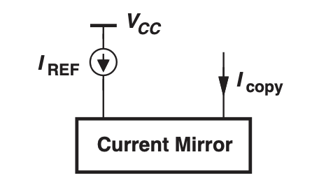

# Current Mirror

In BJT and MOS amplifiers, the biasing currents are often dependent on the supply voltage and the temperature.

However, in certain applications such as the mobile phone, the supply voltage could vary. We also want the phone to be operating in different temperatures across the world.

The **Bandgap Reference Circuit** is a circuit that removes dependence on the supply voltage and the temperature.

However, the bandgap reference circuit is hard to produce and the mobile phone needs many of these.

As a result, we need a method to copy the bandgap reference circuit, which is the purpose of the **Current Mirrors**.

**Solution 1:** Bandgap Reference Current creates supply and temperature independent of voltages and currents. However, it's complex and can not be used everywhere in the circuit.

**Solution 2:** Bandhap reference provides a "golden current" as $I_{ref}$ and uses the **current mirror** to **copy** $I_{ref}$ without replicating the entire bandgap circuitry.

**Doubling the emitter area in BJT doubles the biasing current**