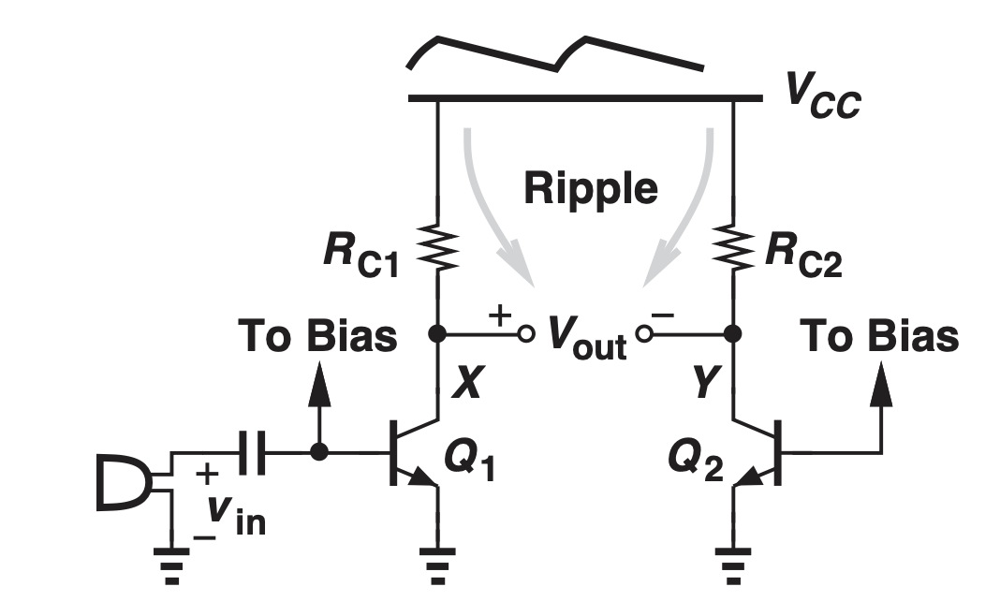
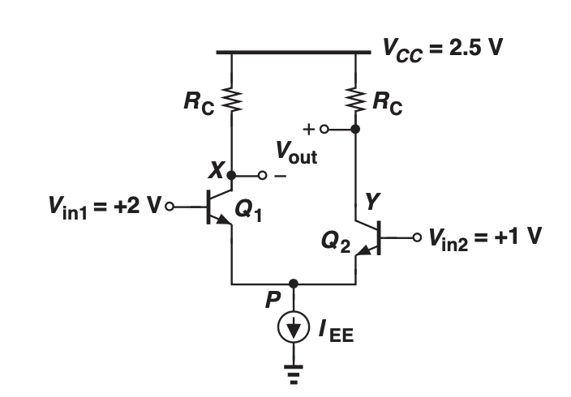
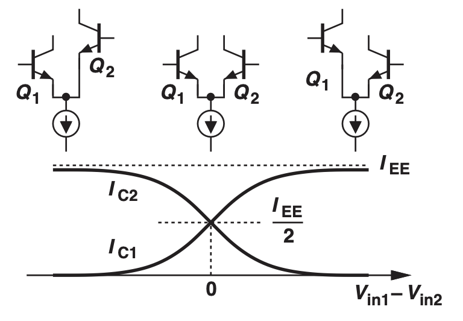
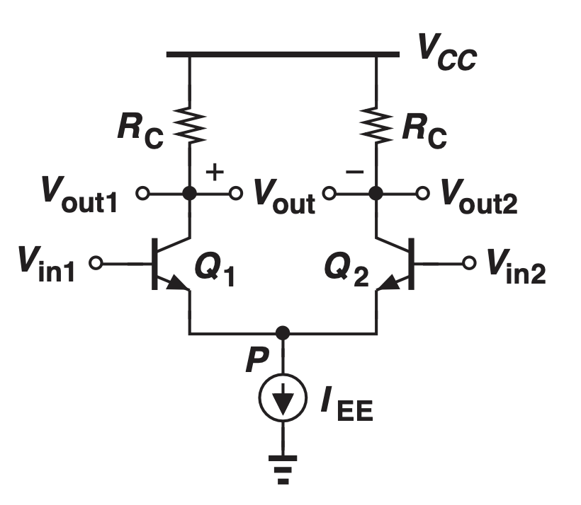
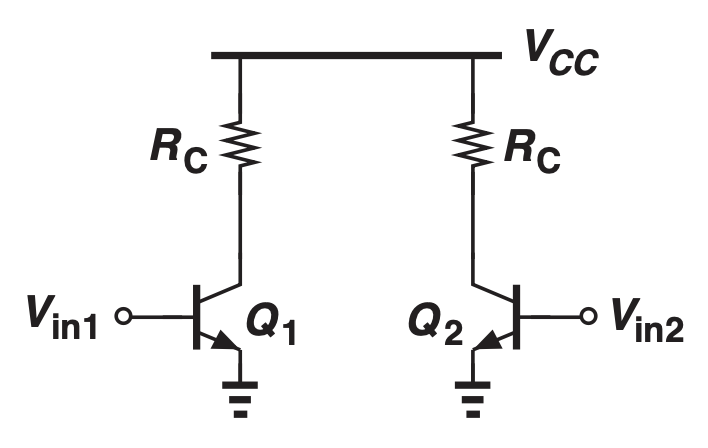

# Differential Amplifier

## Summary
* Differential amplifier is immune to variation in the supply voltage.
* With the same input voltage, the collector current is the same. However, the collector current will be greater on the BJT with greater input voltage.
* The small signal input needs to be 180 degrees out of phase.
* Input Voltage common to both nodes is rejected.
* Common-Mode Rejection: Rejects voltage common to both input 

If we can build an amplifier that amplifies the difference between two Common emitter output voltages, we can get rid of the ripple in both of the outputs.

Assume that

$$v_X = A_v v_{in} + v_{ripple}$$

$$v_Y = v_{ripple}$$

$$v_X - v_Y = A_v v_{in}$$

The ripple from the power supply is taken away when finding the difference between the two outputs.

## Large Signal
### Qualitative Analysis
Consider the following differential amplifier

What's $I_{C1}$ and $I_{C2}$ if $\beta$ is large?

$I_{C1} = I_{EE}$ and $I_{C2} = 0$

Explanation: 

Assume $I_{C2} > 0$ and $I_{C1} \neq I_{EE}$, $V_{BE2} \approx 0.7 V$ 

Since $V_{in2} = 1 V$, $V_{E2}$ is about $0.3 V$. That means $V_{E1}$ is $0.3 V$.

However,  this means $V_{BE1} = 2 - 0.3 = 1.7 V$. This is a high base-emitter voltage and will exponentially drive an enormous amount of current. Since $I_{C1}$ cannot exceed $I_{EE}$, this situation is false. Therefore, $I_{C1} = I_{EE}$ and $I_{C2} = 0$. 

This analysis applies when the input voltages are different vastly.

### Quantitative Analysis

$$I_{C1} = \frac{I_{EE} e^{\frac{V_{in1} - V_{in2}}{V_T}}}{1 + e^{\frac{V_{in1} - V_{in2}}{V_T}}}$$

$$I_{C2} = \frac{I_{EE}}{1 + e^{\frac{V_{in1} - V_{in2}}{V_T}}}$$

## Small Signal

If $V_{in1} = -V_{in2}$, the common node of the differential pair is a **constant ground**.

* Non-zero differential input causes variation in output voltages and current.
* Zero differential input produces no variations.
* In a differential amplifier, the node at the line of symmetry won't change (AC ground).
* Has the same gain as that of the common emitter amplifier but consumes twice the power (2 BJT).
* The small signal model of the differential amplifier could be reduced to two identical half circuits that have the same gain. 
* The differential gain of the differential amplifier is the same as its half circuit.
* We can always ground the nodes shared by two half circuits in the line of symmetry.

