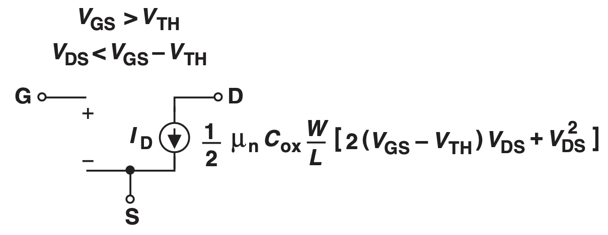

# MOS Transistor

## Summary

We want a voltage-controlled current source. 

In the NMOS case, we want the drain current to depend on the gate-source voltage but not depend on the drain-source voltage.

### NMOS

Saturation: 
 * $V_{GS} > V_{TH}$
* $V_{DS} > V_{GS} - V_{TH} \space or \space V_{GD} < V_{TH}$

$$I_D = \frac{1}{2}\mu_n C_{ox} \frac{W}{L}(V_{GS} - V_{TH})^2 (1 + \lambda V_{DS})$$

$$r_o = \frac{1}{\lambda I_D}$$

$$g_m = \frac{\partial I_D}{\partial V_{GS}}$$

$$= \mu_n C_{ox} \frac{W}{L} (V_{GS} - V_{TH})$$

$$= \sqrt{2 \mu_n C_{ox} \frac{W}{L} I_D}$$

$$= \frac{2 I_D}{V_{GS} - V_{TH}}$$

### PMOS

**Regions of Operation**

* Saturation: $V_{DS}\leq V_{GS} - V_{TH}$
* Edge of Saturation: $V_{DS} = V_{GS} - V_{TH}$
* Triode: $V_{DS} > V_{GS} - V_{TH}$

**Large Signal Model**

$$I_{D, Sat} = -\frac{1}{2}\mu_p C_{ox} \frac{W}{L}(V_{GS} - V_{THP})^2 (1-\lambda V_{DS})$$

$$I_{D, Triode} = -\frac{1}{2}\mu_p C_{ox} \frac{W}{L} [2(V_{GS} - V_{THP})V_{DS} - V_{DS}^2]$$

Small Signal Model - Same for NMOS and PMOS

## NMOS Region of Operations - Saturation

The Saturation region is suitable for amplifier design.

$$V_{GS} > V_{TH}$$

$$V_{DS} > V_{GS} - V_{TH} \space or \space V_{GD} < V_{TH}$$

Here, the drain current is: 

$$I_D = \frac{1}{2}\mu_n C_{ox} \frac{W}{L}(V_{GS} - V_{TH})^2 (1 + \lambda V_{DS})$$

where $\mu_n$ is the mobility of electron, $W$ and $L$ are the width and length of the device, $\lambda$ is the channel length modulation coefficient.

## Small Signal

$$r_o = \frac{1}{\lambda I_D}$$

$$g_m = \frac{\partial I_D}{\partial V_{GS}}$$

$$= \mu_n C_{ox} \frac{W}{L} (V_{GS} - V_{TH})$$

$$= \sqrt{2 \mu_n C_{ox} \frac{W}{L} I_D}$$

$$= \frac{2 I_D}{V_{GS} - V_{TH}}$$

## Transconductance

$g_m$ or transconductance is a measure of how much drain current changes for a given change in $V_{GS}$

$$g_m = \frac{\partial I_D}{\partial V_{GS}} = \mu_n C_{ox} \frac{W}{L} (V_{GS} - V_{TH})$$

$g_m$ is the slope of $I_D$ $V_{GS}$ graph

$g_m$'s value depends on what parameter the designer keeps constant.

For a constant $I_D$, 

$$g_m = \sqrt{2 \mu_n C_{ox} \frac{W}{L} I_D}$$

For a constant $V_{GS} - V_{TH}$

$$g_m = \frac{2I_D}{V_{GS} - V_{TH}}$$

Increasing the width of MOSFET is equivalent to putting them in parallel, and this increases the $g_m$

## NMOS Region of Operations - Triode

$$V_{GS} > V_{TH}$$

$$V_{DS} < V_{GS} - V_{TH} \space or \space V_{GD} > V_{TH}$$

$$I_D = \frac{1}{2} \mu_n C_{ox} \frac{W}{L} [2(V_{GS} - V_{TH})V_{DS} + V_{DS}^2]$$

## NMOS Region of Operations - Deep Triode

The MOS transistor behaves as a variable resistor

$$V_{GS} > V_{TH}$$

$$V_{DS} << 2(V_{GS} - V_{TH})$$

$$R_{on} = \frac{1}{\mu_n C_{ox} \frac{W}{L}(V_{GS} - V_{TH})}$$